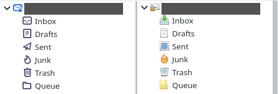

# ✉️ thunderbird_color_icons

override new mono icons with old color icons

# ⚙️ usage

To use this you will need to copy the `chrome` folder to your current profile & enable `userChrome.css`

If you already have userChrome overrides you may want to manually edit your existing file (& copy the provided icons).

## enable userChrome.css

`Preferences` > `Scroll to Bottom` > `Config Editor...`
`toolkit.legacyUserProfileCustomizations.stylesheets` : `true`

## profile folder

Linux: `$HOME/.thunderbird/`

Windows: `%AppData%\Roaming\Thunderbird\Profiles\`

userChrome example in linux would be `$HOME/.thunderbird/xxxxxx.default/chrome/userChrome.css`

# Contact

Website: https://equk.co.uk

Twitter: [@equilibriumuk](https://twitter.com/equilibriumuk)
